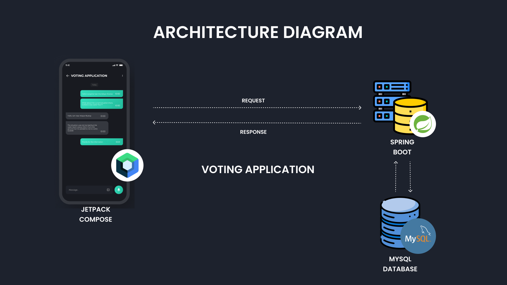
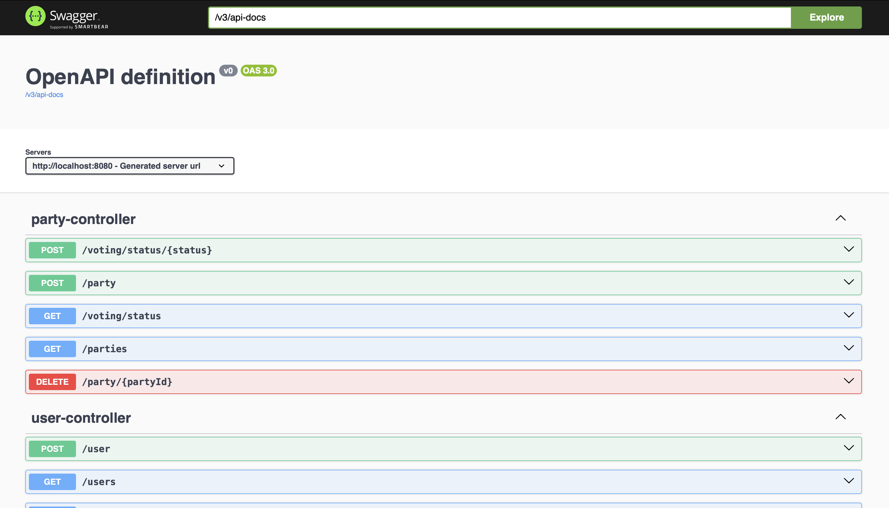
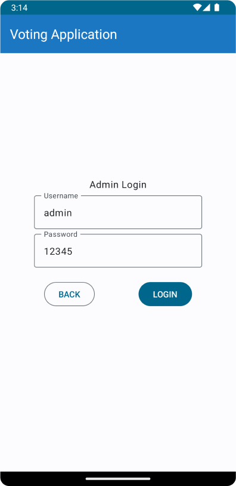
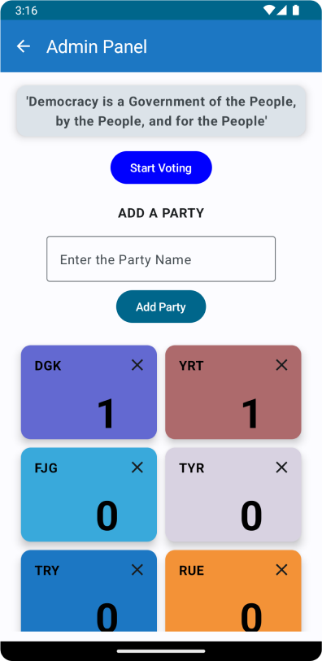
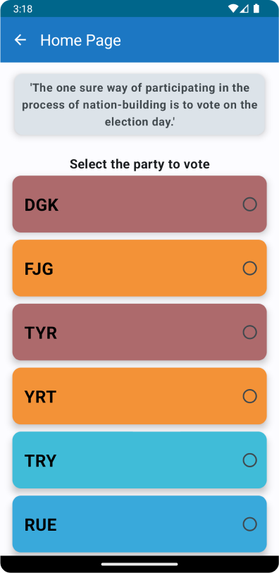
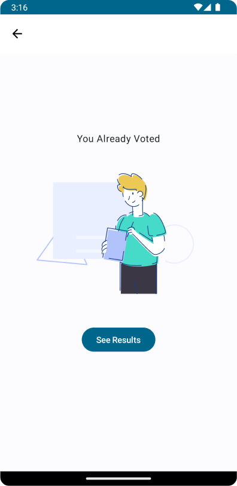

# Voting Application - Documentation

## TECHNOLOGIES USED

- JETPACK COMPOSE
- SPRING BOOT
- MY SQL

## **Features of the Voting system Application**

- AUTH - signup, login (separate for admin and users)
- Admin can add or remove parties
- Admin can start and end the voting
- Users can select and vote only one party
- Results will be declared once the voting is completed

## **APPLICATION ARCHITECTURE DIAGRAM**

## **BACKEND**

This provides an overview of the backend components of the Voting Application developed using Spring Boot and MySQL. The application includes functionality for user authentication, party management, user management, and voting operations.

### Controllers and Functionalities

1. **AuthController**
    - **`/auth/sign-in - @POST`**
        - Endpoint for user sign-in.
        - Creates a new user if the username is unique.
        - Throws an exception if the username already exists.
    - **`/auth/login - @POST`**
        - Endpoint for user login.
        - Validates user credentials and returns a success message upon successful login.
2. **PartyController**
    - **`/parties - @GET`**
        - Endpoint to retrieve all parties.
    - **`/party - @POST`**
        - Endpoint to add a new party.
        - Throws an exception if the party name already exists.
    - **`/party/{partyId} - @DELETE`**
        - Endpoint to delete a party by ID.
    - **`/voting/status - @GET`**
        - Endpoint to get the current voting status.
    - **`/voting/status/{status} - @POST`**
        - Endpoint to change the voting status.
        - Updates user voting status and resets party votes when starting or ending voting.
3. **UserController**
    - **`/users - @GET`**
        - Endpoint to retrieve all users.
    - **`/user/{userName} - @GET`**
        - Endpoint to find a user by username.
    - **`/user - @POST`**
        - Endpoint to add a new user.
    - **`/user/{userId} - @DELETE`**
        - Endpoint to delete a user by ID.
    - **`/user/vote/{userId}/{partyId} - @GET`**
        - Endpoint for user voting.
        - Updates user voting status and increments party votes.
4. **Swagger UI**

The application includes Swagger UI for easy development and testing. Swagger UI provides a user-friendly interface to explore and test the available endpoints.

- **Swagger UI Endpoint:** **`http://localhost:8080/swagger-ui/index.html`**

## FRONTEND

This provides an overview of the frontend components of the Voting Application developed using Jetpack Compose with Kotlin. The application includes several screens, each serving a specific purpose, such as user authentication, home page, admin panel, and result page.

### DEPENDENCIES USED

The frontend application utilizes various additional dependencies for enhanced functionality:

- Navigation: **`androidx.navigation:navigation-compose:2.7.7`**
- View Model: **`androidx.lifecycle:lifecycle-viewmodel-compose:2.7.0`**
- Lottie Animation: **`com.airbnb.android:lottie-compose:4.0.0`**
- Retrofit for Networking:
    
    **`com.squareup.retrofit2:retrofit:2.9.0`**, **`com.squareup.retrofit2:converter-gson:2.9.0`**, **`com.squareup.okhttp3:okhttp:4.11.0`**, **`com.squareup.okhttp3:logging-interceptor:4.10.0`**
    
- Confetti Animation: **`nl.dionsegijn:konfetti-compose:2.0.4`**

### SCREENS AND VIEWMODELS

### **1. Login Page (`LoginPage`)**

- ViewModel: **`AuthViewModel`**
- Responsible for user authentication, sign-in, and login.
- Displays a form for user input and buttons for sign-in and login.
    
    
    

### **2. Admin Panel (`AdminPanel`)**

- ViewModel: **`AdminViewModel`**
- Provides administrative functionality, including adding and deleting parties.
- Retrieves and displays the list of parties and the current voting status.
    
    
    

### **3. Home Page (`HomePage`)**

- ViewModel: **`HomeViewModel`**
- Displays user-specific information, available parties, and the voting status.
- Allows the user to vote for a selected party.
    
    
    

### **4. Already Voted Page (`AllReadyVotedPage`)**

- ViewModel: N/A
- Informs the user that they have already voted.
    
    
    

### **5. Result Page (`ResultPage`)**

- ViewModel: **`ResultViewModel`**
- Displays the result of the voting, including the winning party and total votes.
    
    
    

### ViewModel Details

### **1. AuthViewModel**

- Handles user authentication, sign-in, and login.
- Retrieves the list of users from the backend.

### **2. AdminViewModel**

- Manages administrative tasks, such as adding and deleting parties.
- Retrieves the list of parties and the current voting status.

### **3. HomeViewModel**

- Provides functionality for the home page, including user-specific information and voting.
- Retrieves the list of parties and the current voting status.

### **4. ResultViewModel**

- Manages the result page, including displaying the winning party and total votes.
- Retrieves the current voting status and calculates the winning party.

### Usage of Best Practices

- Utilizes Jetpack Compose for a declarative and reactive UI.
- Implements ViewModels for better code segregation and maintainability.
- Follows best practices for error handling, including displaying error messages in Toast.

### Conclusion

This documentation provides an overview of the frontend structure, screens, and ViewModels used in the Voting Application. For detailed information on each screen's functionality and interaction with the backend, refer to the corresponding code sections and comments.